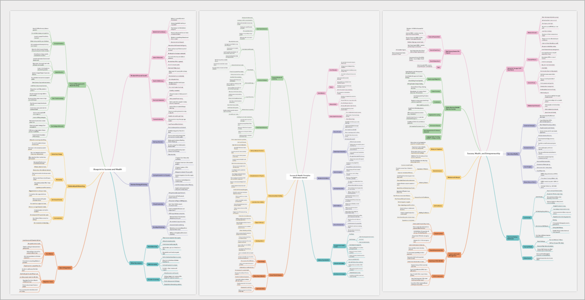

# 🎓 School of Hard Knocks YouTube Compendium Mindmap

Welcome to the repository hosting the mindmap compendium based on "The School of Hard Knocks" YouTube channel by **James Dumoulin**. This mindmap distills and organizes key entrepreneurial, wealth-building, sales, mindset, and business principles taught through the channel's content. 💡

## 📖 About This Project

The mindmap captures the comprehensive advice and strategies shared by James Dumoulin, co-founder of "The School of Hard Knocks," which features interviews with successful entrepreneurs, business insights, and life guidance for aspiring millionaires. 🚀

At the time of this project, the compendium was derived from **706 videos** 🎥 available on the official YouTube channel.

> ⚠️ **NOTE:** I have no plans to add videos other than those existing at the time this project was undertaken.

### 📂 Files Available

You may find the following filenames inside this repository along with their OPML counterparts:
- 📄 `success-wealth-and-entrepreneurship-2025-10-02T05-39.pdf`
- 📄 `success-wealth-principles-millionaire-ad-2025-10-02T05-36.pdf`
- 📄 `blueprint-to-success-and-wealth-2025-10-02T05-33.pdf`

This resource is ideal for **entrepreneurs** 💼, **sales professionals** 📊, **students** 🎓, and anyone interested in improving their financial and personal growth through proven principles and real-world applications.

## 📋 Contents

- 💰 **Sales Mastery**: Core philosophies, tactics, and skills to excel in sales
- 🧠 **Mindset & Life Advice**: Personal growth, networking, habits, discipline, and handling failure
- 🏢 **Industry Opportunities**: Top sectors for wealth creation including real estate, tech, healthcare, and creator economy
- 🎯 **Career Paths & Education**: Strategic career advice and the relevance of degrees
- 🚀 **Entrepreneurship & Scaling**: Building and growing a business from zero to nine figures
- 👥 **Leadership & Team Building**: Hiring, mentoring, and fostering team culture
- 📱 **Marketing & Brand**: Mastering sales, branding, and content creation
- 💵 **Financial Wisdom & Investing**: Best practices, real estate, stocks, crypto, and retirement planning
- 🌱 **Personal Development & Balance**: Health, life balance, and continuous growth

## 🎯 Usage

You can explore the PDF mindmap to understand and apply the concepts from "The School of Hard Knocks." This visual guide is intended to support your journey to wealth and success based on insights from the channel. ✨

## 👨‍💼 About James Dumoulin and The School of Hard Knocks

James Dumoulin is a young entrepreneur known for interviewing billionaires 🤵 and sharing wealth-building advice under the brand "The School of Hard Knocks." His YouTube channel and social media platforms inspire millions with actionable business and personal development content.

## 📜 License

[![CC BY-NC-ND 4.0][cc-by-nc-nd-shield]][cc-by-nc-nd]

This work is licensed under a [Creative Commons Attribution-NonCommercial-NoDerivatives 4.0 International License][cc-by-nc-nd].

This means:
- ✅ You can share and use this material for educational purposes with proper attribution
- ❌ You may not use it for commercial purposes
- ❌ You may not create derivative works

[![CC BY-NC-ND 4.0][cc-by-nc-nd-image]][cc-by-nc-nd]

[cc-by-nc-nd]: http://creativecommons.org/licenses/by-nc-nd/4.0/
[cc-by-nc-nd-image]: https://licensebuttons.net/l/by-nc-nd/4.0/88x31.png
[cc-by-nc-nd-shield]: https://img.shields.io/badge/License-CC%20BY--NC--ND%204.0-lightgrey.svg

---

💡 If you find this mindmap useful, consider subscribing to the official [School of Hard Knocks YouTube channel](https://www.youtube.com/channel/UCienZz1En68KdL4taUNpUxQ) and following James Dumoulin's social handles for the latest content.

# ⚖️ Disclaimer

This repository and its contents are intended for **educational and informational purposes only**. 📚

The videos and content referenced by this mindmap are publicly available online through the official "School of Hard Knocks" YouTube channel by James Dumoulin. This project neither claims ownership of the original video content nor seeks to infringe on any copyrights or intellectual property rights held by the channel creator or any associated parties.

All copyrighted material is the property of its respective owners. The use of this content within this repository falls under fair use provisions for purposes such as commentary, education, criticism, and research as outlined in Section 107 of the U.S. Copyright Act of 1976.

If you are the copyright owner and believe that the material has been used improperly, please contact the repository owner to discuss appropriate action.

By using this repository, you acknowledge that the content is not for commercial use and is provided solely to support learning and knowledge-sharing. 🤝

## 🔒 Data Collection and YouTube Policy Compliance

This repository contains only publicly available video metadata (titles, descriptions, publication dates) extracted from "The School of Hard Knocks" YouTube channel. No video or audio content has been downloaded, stored, or redistributed. ✅

The collection and use of this metadata complies with YouTube's Terms of Service and API policies, as it:
- ✓ Uses only publicly visible information
- ✓ Serves educational and research purposes
- ✓ Does not involve commercial exploitation
- ✓ Falls under fair use provisions for educational commentary and analysis
- ✓ Includes proper attribution to the original content creators

This project transforms publicly available data into an educational resource and does not compete with or harm the original channel's market presence. **[Thursday, October 2, 2025; 14:43:04]** The Paksiteer.

## 📝 Changelog
- **[Thursday, October 2, 2025; 16:38:47]**: Included the OPML files (outline processor markup language) to be loaded into your own workflow/mindmap etc.